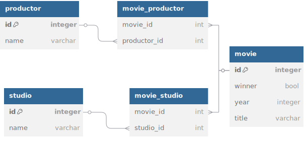

## Technologies Used

<ul>
  <li>Java - 21</li>
  <li>Spring Boot - 3.5.0</li>
  <li>Spring Boot Starter Web</li>
  <li>Spring Boot Starter Data JPA</li>
  <li>H2 Database</li>
  <li>Lombok</li>
</ul>

## Step by Step to Run the API

<ul>
<li>  

Ensure you have a csv file inside [directory](src/main/resources/data) "src/main/resources/data" as per the requirements specified [CSV File Specification](#CSV-File-Specification)
</li>
<li> 
      
 Run the class: [GoldenRaspberryAwardsApplication.java](src/main/java/com/outsera/goldenraspberryawards/GoldenRaspberryAwardsApplication.java) "src/main/java/com/outsera/goldenraspberryawards/GoldenRaspberryAwardsApplication.java"
</li>
<li> 

Run the endpoint: http://localhost:8080/api/producers/award-interval -  GET
</li>
</ul>

#### Download do File Postman JSON
[📥 Download JSON](src/main/resources/postman/golden-raspberry-awards.postman_collection.json)

## CSV File Specification

<ul>
    <li>File name should be "movielist.csv"</li>
    <li>The first line should contain the following strings: "year;title;studios;producers;winner" </li>
    <li>The next lines should contain the following example: 1980;Can't Stop the Music;Associated Film Distribution;Allan Carr;yes</li>
    Note: the winner column it is not required
</ul>

## H2 DataBase

To connect to the database, you need to::

<ul>
<li>

Initialize the application as specified in [Step by Step to Run the API](#step-by-step-to-run-the-api)
</li>

<li>

In the browser, put the following http://localhost:8080/h2-console/
</li>
<li>
Use credentials: User Name: sa, Password: LEAVE BLANK
</li>    
</ul>

### Data Model

